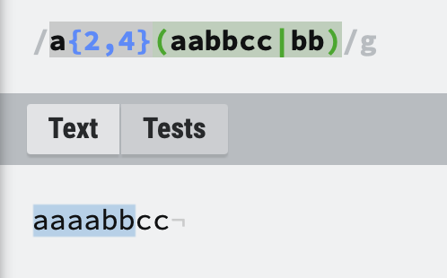

## Regex (What in the world is Regex anyways?!?)

Have you ever come across bizarre code that is difficult to read and full of unfamiliar characters and symbols? Or maybe it looks like the cat walked across the keyboard, on it's tech savvy owner's coffee break in between coding shifts. Ah...yes, now it's coming to you perhaps in a way that looks like ``` /^([a-z0-9_\.-]+)@([\da-z\.-]+)\.([a-z\.]{2,6})$/ ?```

Without further ado...**insert drum roll here** Welcome to the world of **Regex** (also known as Regular Expression)! While looking at Regex it can be quite terrifying and intimidating, but rest assured by the end of this guide you will be able to identify the key foundations and soon be writing your own Regex! During this tutorial, I will review what Regex is, how it works, along with the benefits, and provide some resource links for you to practice and dive deeper into Regex on your own. Oh, and I'll try to keep it as entertaining as possible too. ;-)

## Summary

Regex inherits it's name from it's meaning, "Regular Expression". In simple terms, Regex is a particular sequence of characters that specifies a search pattern. The benefits of having a particular search pattern such as Regex, allows a secure way to "find" or "find and replace" operations on "strings" (text), offering input validation. Regex comprimises of both metacharacters, having a special meaning, or regular characters, the literal character. For example in regex ```'z'```, ```'z'``` is the literal character that matches just ```'z'``` while ```'.'``` is a metacharacter that matches each character **except** a newline. Another example ```[a-z]```, matches all lower case letters ```a-z```. In the section below let's look at some metacharacters you may see in Regex:

Some metacharacters well known in Regex are: 

 ```. [ { ( ) \ ^ $ | ? * +```

(Don't worry we will go over these in details throughout the tutorial, for now just get comfortable with knowing what these look like and associating them with metacharacters)

Also, note that Regex is not specific to any one programming language. Instead, it's generally easy to cross-carry-over to other programming languages. 

```Note: there may be different flavors of Regex out there, but the general concepts remain fluid across programming platforms.```


Regex is a great identifier because you can create a Regex for almost any pattern you can think of! Let's dive in a little bit deeper and discover the key components of Regex.


Quick tip: Some characters need to be escaped. In order to escape characters you must use the "\".
e.g. If you wanted to search a literal "\" you need to escape it with the "\" itself. example: \\\ 


## Table of Contents

- [Anchors](#anchors)
- [Quantifiers](#quantifiers)
- [Boundaries](#boundaries)
- [Greedy and Lazy Match](#greedy-and-lazy-match)
- [Back-references](#back-references)
- [Look-ahead and Look-behind](#look-ahead-and-look-behind)
- [OR Operator](#or-operator)
- [Character Classes](#character-classes)
- [Flags](#flags)
- [Grouping and Capturing](#grouping-and-capturing)
- [Bracket Expressions](#bracket-expressions)

## Regex Components

### Anchors
Anchors are unique in regular expressions because they match a position rather than a character.
Let's take the following example:
The ^ anchor matches the beginning of the text, where the $ matches the end. Let's look at an example:

```let str = 'Regex' ```

```console.log(/^R/.test(str))```

```Output: true```

In this example the ```/^R/``` matches any text that starts with the letter "R". The following example returns **false** because the Regex doesn't start with the letter "L".

```let str = 'Regex' ```

```console.log(/^L/.test(str))```

```Output: false```

Anchors are very useful in checking that a string fully matches a pattern. 


### Quantifiers
When observing the word "Quantifiers" what comes to your mind? If you thought of quantity you are right! Quantifiers do just that! In Regex quantifiers are used to quantify how many times a part of your Regex should be repeated.
The following list shows some examples of the most common quantifiers:

```
?
*
+
{N}
{,N}
{N,}
{N,M}
```

Hmmm....
To enrol, or not to enroll? 
----
Let's take a look at an example:
A common word that can be spelled two different ways is **"enroll"** or **"enrol"**. Depending on the author's preferences. If you wanted to use a quantifier that can search against (match) both of these spellings using Quantifiers, your Regex would look similiar to:

```
enrol{1.2}
```

The qualtifier in this example is ```{1,2}``` and means whatever came just before the quantifier repeated anywhere between one to two times. In our example "l" came just before the quantifier, therefore, the "l" may be repeated one to two times thus matching both of our search patterns for "enrol" and "enroll". 

If we wanted to match the mispelling of enroll from "enroll" to "enroll" we would just change the upper range of our quantifier to ```{1,3}```. By doing this our Regex will now match: ```enrol, enroll, and enrolll```. See, not so bad eh?!

When using this Regex quantifier we are using the  ```{N,M}``` method. Where the letters  ```N and M``` are placeholders representing ```N``` as the minimum number of repititions, and ```M``` as the maximum number of repititons. It's also important to note that ```N``` and ```M``` are both positive integers. It is also important to take note that ```M``` left blank is to represent ```infinity```

Your turn!(Didn't think I'd let you off the hook that easy did ya?!):

See if you can write a Regex that matches the spelling of both 'mis' and 'miss'. 

***see answer key at the end for solutuions**

### Boundaries

Sometimes quantifiers are written as ```{,3}``` where the endpoints of the range are instead, implied, and are not explicitly written. Let's look at the following example: ```x{,7}``` This quantifier can be interpretted as repeat the character ```x``` from it doesn't matter times to seven times. To describe the same quantifier above, we could use ```x{0,7}``` meaning repeat the character ```x``` anywhere from ```0``` times to ```7``` times.

Alternatively, you will sometimes see the upper bounds of the quantifier implied. Let's explore this using our same ```x``` search value. ```x{4,}``` This can be assumed and interpretted as ```x{4,infinity}```. However,since there is no way to write infinity explicitly, we must stick to the ```x{4,}``` Regex interpretation. Regex engines would interpret ```infinity``` as a literal text, and that's not what we want here.

Let's take another scenario when a Regex is used with a quantifier of a single digit such as ```x{4}```. This can be interpreted that the single character ```x``` should be matched **exactly** four times. We could write the same expression in a similiar fashion ```x{4,4}```. 

So what about these ```*```,```?```,```+``` quantifiers? you might ask... These quantifiers can be looked at as "syntactical sugar" in Regex where: ```*```is the same as  ```{0,}```, ```?``` is the same as ```{0,1}```, and ```+``` is the same as ```{1,}```.

Let's review what we've learned this far:


Quantifiers can also be applied to character classes too! For example, let's say we wanted to match Chapter titles in a book regardless of how many digits are in the Chapter. 

```Chapter [0-9]+``` matches strings like these:

```Chapter 1```, 

```Chapter 23```,

```Chapter 32497```, and

```Chapter 888```.

Another way quantifiers are useful is utilizing them with a sub expression, to repeat the sequence of characters. Let's explore this through the following example:

```(hi){3,5}``` will match the following (highlighted in our test scenario below):


As we can see our Regex mataches the subexpression ```hi``` starting at 3 and up to 5 times, as noted by it's lower and upper boundaries.

Quantifiers may also be utilized with sub expressions that contain alterations like such:```plant|animal|reptile {1,3}```


Let's review some of the key fundamentals of quantifiers. These include:

```1)the minimum number of times it can match```  (reviewed already)

```2)the maximum number of times it can match```  (reviewed already)

```3)As many vs. as few times as possible```

```4) Whether it will disable backtracking or not```

### Greedy and Lazy Match

Since we've reviewed the first two. Let's transition to number three. How do we tell wether or not Regex refers to as many vs. as few times as possible? Thus far we have used the quantifiers ?
*
+
{N}
{,N}
{N,}
{N,M}, which are known as greedy and will match as many times as possible. Take the following Regex example:

```a{2,4}(aabbcc|bb)```
Let's evaluate how this works by observing below:


Here we can take note that this Regex is 'greedy' because it matches ```a``` **as many times as possible** with the upper boundary being ```4``` instead of the minimum lower boundary as ```2```. So how do we spefify as few times as possible? Well, it's easy - just add a ```?```!

Let's revisit the same example, except this time using the ```?``` to show as few times as possible:


Now we can see that the Regex uses the lower boundary, thus being what's known as 'lazy' and matching the whole Regex because two ```a's``` were the lower boundary allowing the Regex to move onto the ```(aabbcc|bb)``` part of the expression.

Lastly, an important fundamental of Quantifiers is backtracking. Backtracking occurs when the Regex engine has to make decisions on whether or not to move forward. Sticking to our example of ```a{2,4}(aabbcc||bb)``` , the quantifier range is ```{2,4}``` meaning that the first two characters ```a``` are mandatory and must match. Now the Regex engine has to make choices. Should I continue to look for ```a's``` or should I move on. The ```greedy``` path says, I will take the ```two a's```and continue to look for up to ```4```. The ```lazy``` path accepts the minimum and moves on. This concept is important to remember when writing your own Regex!

### OR Operator

In Regex, the ```OR Operator``` allows you to compare values being either one ```OR``` the other when matching patterns. To use the ```OR Operator``` in Regex, simply use the ```|```. Let's say you wanted to match the text that has 'hot' or 'cold'. To do this we could write the Regex ```hot|cold```. Let's explore what this would look like when utilizing this Regex.


As we see the ```OR Operator``` matches either 'hot' or 'cold', as written in our Regex ```hot|cold```.

When using the ```OR Operator```, we can also search for text before the ``OR Operator`` helping us narrow down our search. Take a look at the example below:

This example shows that we are explicitly searching for the ```a``` character followed by a ```space``` then the word hot ```OR``` cold.

Now you try! See if you can create a Regex that searches for the words lemon or lime. 

**Answers provided in answer key**

### Character Classes
Regex ```Character Classes```, also known as ```Character Sets``` allow us to tell the Regex engine which characters we want to match. This is very beneficial when searching text in documents that you do not know if are written in American or British. You could use the Regex ```gr[ae]y``` if you are searching a text pattern to match ```grey``` or ```gray```. Keep in mind that this is matching a single character ```a``` or ```e``` not ```graey```. Character classes are commonly used with not just letters, but also digits such as ```[0-9]```. And if your asking yourself can you use character classes mixing letters and numbers, the answer is yes you can! An example of this could be something like ```[a-c0-5]```, where this Regex searches for all characters ```a-c``` and ```0-5```. There are special characters like ```-``` and ```^``` that play key roles in character classes. If you are used to Javascript, you can think of the ```^``` as an ```!``` sense. The ```^``` means is NOT. For example ```[!0-5]``` means return ANYTHING that is NOT ```0-5```.
Let's take another look at the example below to understand a bit more of how this works.


Here we can see that using the ```[^a]``` is selecting everything that is NOT ```a```. 

Your turn: Create a Regex that searches both link and lynk.

Don't be afraid to play around seeing what you can and can't select too!

### Flags

### Grouping and Capturing
Grouping and Capturing occurse when we add additional criteria to our Regex. We do this by adding ```()``` to our. When we group things we can first think of the big picture. For example, suppose I had a list of phone numbers as follows:

864-323-1928,

983-932-3242,

234-239-2329

The first way we could capture these numbers is by capturing the whole thing. We accomplish this by writing the following Regex:

```\d{3}-\d{3}-\d{4}```

Now, suppose we want just the middle three numbers of each whole phone number (9 digits). How could we get that information seperate (key word here) from the whole phone number? We can do this by using ```()``` to group the information that we want seperately. This would resemble something like: ```\d{3}-(\d{3})-\d{4}``` As we can see the middle of the phone number is encompassed by ```()```. When this is done, the Regex assigns all within ```()```(submatch) as 'Group Zero'. 

Now, let's pretend we expand this Regex by adding an additional group, this time also including the last four digits. To do this it would look something like the following:
```\d{3}-(\d{3})-(\d{4})``` where ```(\d{3})```is assigned submatch as Group Zero and ```(\d{4})``` is assigned submatch as Group One. As you can see, each additional ```()``` identifies a submatch of that entity.

### Back-references
You can refer to these groups later by using ```$1```or ```/1``` to refer to group one etc. Capturing and replacing is something that can be used after grouping. For example, let's refer back to the list of phone numbers and say that I wanted to capture the area code of each number and replace the rest of the numbers with xxx-xxxx. To do this in Regex, I could write:
Find:
```(\d{3})[-]\d{3}[-]\d{4}```
Replace: (here let's identify Group One (note Group One because Group Zero here would be the whole string captured) in ( ) above) $1-XXX-XXXX. Now the previous listed phone numbers would return as:

864-XXX-XXXX,

983-XXX-XXXX,

234-XXX-XXXX

Pretty nifty I must say so myself!
A challenge you can do is try and find and replace Regexes using Groups/Capturing. When we us the ```$``` in our referencing to groups, we are essentially saying 'Use what I've captured and replace'.

Alternatively, let's observe how Regex can become pretty powerful. Let's say I have a list of thousands of names where the structure is written last name, first name. For example, my list contains:

Smith, Jason

Smith, Jack

Smith, Joey

Smith Joseph ...

Remember, I have thousands of users that I am wanting to reorganize into first name, last name instead. It would be very tidious, and possibly multiple days worth of work to manually by hand delete, cut, paste and switch last name and first names. With Regex we can resolve our issue in a matter of minutes. To do this we first can match our first and last names using: ```\w+,\s+\w``` this means any number of word characters (```\w```), followed by a comma (```+,```), followed by white space (```\s```), followed by any number of word characters (```\w```).

Great! We've matched our list of names, now lets capture the last name and the first name by adding our ```()```. Try this on your own first using our previous example! Your capturing of the last and first name should resemble ```(\w+),\s(+\w)```. Here we have captured the last name ```(\w+)``` and the first name ```(+\w)```. Now that we have our captured information we can easily replace in the replace text editor using ```$2 $1``` (remember ```$0``` is the whole thing). Here we say group two (```$2```) our first names come first then group one (```$1```) our last names. Now our names look like:

Jason, Smith

Jack, Smith

Joey, Smith

Joseph, Smith

...instead.

A lot easier than all that cut, copy, paste, delete stuff!

### Bracket Expressions
Bracket expressions are a list of characters enclosed with brackets '```[ ]```', it matches any single character within them. For example, ```[0123456789]``` will match any single digit. Whereas, ```[^()]``` , matches any single character that is **not** (remember that little ```^``` holds powerful meaning!) an opening or closing parenthesis.

### Look-ahead and Look-behind
Look-ahead can be useful when trying to match data that comes before a specific thing you are trying capture. To use look ahead you need to simply write ```(?= what you are wanting to look-ahead of here)```. Let's explore in the following example:

In this example we are wanting to look-ahead(or before) and match what comes before the text "ahead". You can see the Regex captures all that comes **ahead** or **before** the defined criteria.

On the other hand, look behind is defined in a Regex by ```(?<=)```. It is useful to use look-behind when trying to match certain data that comes **after** the defined criteria. For example:


In the example, you can see we are defining the look behind when we use the previously mentioned ```(?<=)``` . When using the look behind method you need to specifiy at what point when searching you are wanting to capture what's "**behind**"( or after). Our example here is looking **behind** or **after** the explicit ```RegExr``` text used. 


### Breaking down an Email Regex Example

/^([a-z0-9_\.-]+)@([\da-z\.-]+)\.([a-z\.]{2,6})$/

Now that we have a general idea how Regex works. Let's break down what's happening in the Email Regex example above. 

The **anchor** used in this regex for email is the ```^```, which indicates the beginning of a string and the ```$```, indicating the end of a string. Next, lets focus our attention to the ```(grouping/capturing which occurs between parenthesis)```. In group one, (remember group zero is the whole entity together as one) we see ```([a-z0-9_\.-])```. This matches the email name. Furthermore, we can tell because inside the **brackets**, it is matching any character in the range "a" to "z", any digits 0-9, underscore character which matches _ , the \ indicates an excape matching a . , and last the - character matching a -. Next, we noticed what every email has the ```@``` symbol, which means without this matching, it wouldn't be an email! We move to our second group/capturing ```([\da-z\.-]+)```. Inside our **brackets** here we see that this group matches any digit character (0-9), characters ranging from a-z,an escaped character matching the ., and the - character matching -. After our **brackets** we see a **quantifier** which matches one or more of the preceding token. 

In between our **capturing/groups** two and three we see an **escaped** character```\``` which matches a ```.``` 

In the third **capturing/group** we can take note of the **brackets** which allow us to again, match any characters within the set, that have a **range** of ```a-z```, **escaped** by ```\``` and matching a ```.``` character. Immediately following our [**brackets**] we see a {**quantifier**} notating a **range {2,6}** telling us to match between two and six of the preceding token.


### Answer Key
Regex matching mis and miss: ```mis{1,2}```

Regex that matches lemon or lime ```lemon|lime```

Regex that searches both link and lynk: ```l[yi]nk```

## Author 
Lexie Crawford is an experienced Full-Stack Web Developer, who is skilled at programming dynamic and versatile web applications. She's a dedicated team player that brings positive energy, integrity, and strong critical thinking problem solving skills. She will maximize productivity, minimize system down time, and achieve established goals of any business. She has a strong education and professional background holding three degrees in: Master of Arts - MA focused in Teaching, B.S. Business Administration/Management, and Associates in Pharmacy Technology. Visit www.lexcraw4d.github.io for more information on adding a great asset to your team!